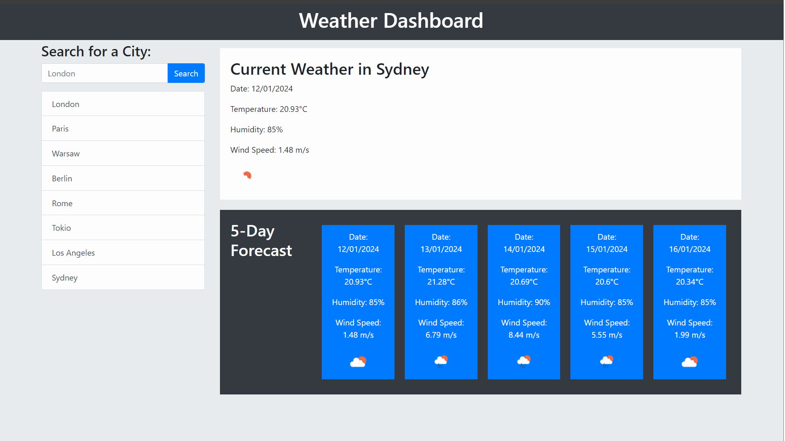

# Weather Dashboard

## Description

The Weather Dashboard is a robust application designed to provide real-time weather updates for various cities, aiding travelers in planning their trips efficiently. Utilizing Server-Side APIs, specifically the 5 Day Weather Forecast API, the app dynamically updates HTML and CSS to reflect current and future weather conditions. The application requires an API key from OpenWeatherMap and uses geographical coordinates for accurate data retrieval.

## Table of Contents
- Description
- Installation
- Usage
- Features
- Screenshot and links
- Credits
- Technologies Used

## Installation

To install and run this weather dashboard:

1. Clone the repository from GitHub.

2. Obtain an API key from OpenWeatherMap and activate it (activation may take up to 2 hours).

3. Replace {API key} in the API call URL with your personal key:

&nbsp;&nbsp;&nbsp;&nbsp;&nbsp;&nbsp;`https://api.openweathermap.org/data/2.5/forecast?lat={lat}&lon={lon}&appid={API key}`

## Usage

Enter a city name in the search box.

View the current weather conditions and a 5-day forecast for the selected city.

The searched city will be added to the search history for quick access in future sessions.

Click on a city in the search history to view its current and future weather conditions again.

## Features

**Real-Time Weather Data:** Displays current weather conditions for any searched city.

**5-Day Forecast:** Shows a five-day weather outlook including temperature, humidity, and weather icons.

**City Search History:** Maintains a list of previously searched cities for easy access.

**Dynamic Content Update:** Utilizes API calls to update the weather information dynamically.

## Screenshot and links

### Link to the Weather Dashboard
https://mrkatrish.github.io/weather_dashboard/

## Credits

Special acknowledgments to:

- OpenWeatherMap for providing comprehensive weather data through their API.
- The Full-Stack Blog for guidance on utilizing API keys.
- The development community for valuable resources and documentation, especially Stack Overflow and MDN Web Docs.
- Your support and resources were invaluable in the creation of this project.

## Technologies Used

- HTML5
- CSS3
- Bootstrap 5
- JavaScript
- Server-Side APIs (5 Day Weather Forecast API)